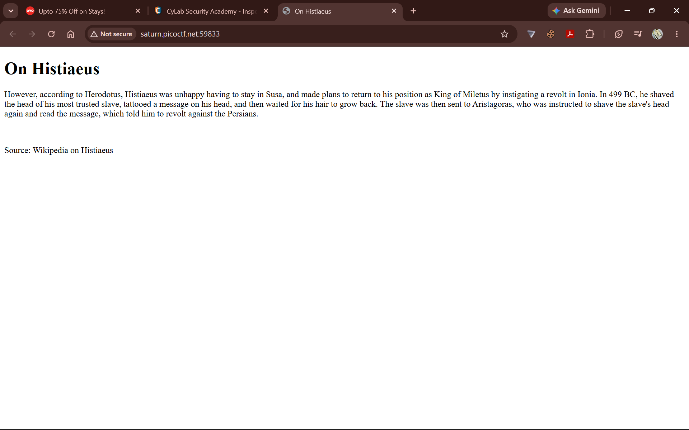
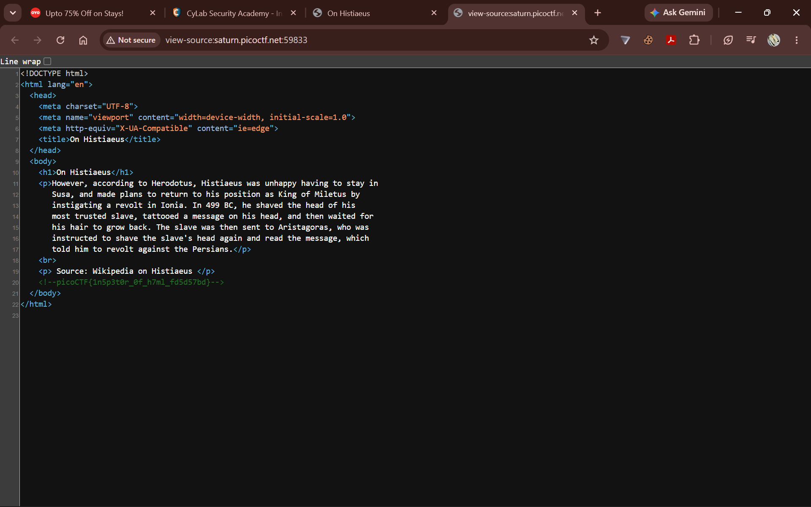

\# Inspect HTML - picoCTF 2022 Writeup


\## Challenge Information


| Category           | Details           |

| ------------------ | ----------------- |

| \*\*Challenge Name\*\* | Inspect HTML      |

| \*\*Category\*\*       | Web Exploitation  |

| \*\*Difficulty\*\*     | Easy              |

| \*\*CTF\*\*            | picoCTF 2022      |

| \*\*Author\*\*         | LT 'syreal' Jones |


\---


\## Challenge Description


> Can you get the flag?


The challenge provides a web application instance. The goal is to inspect the application and find the hidden flag.


\---


\## Initial Analysis


After launching the challenge instance, the webpage displayed information about \*\*Histiaeus\*\*, a historical figure mentioned by Herodotus.


The page itself did not visibly display the flag.


However, the challenge title, \*\*Inspect HTML\*\*, suggested that the solution could be found by examining the webpage's underlying HTML source code.


\---


\## Solution


\### Step 1: Launch the Challenge Instance


First, I launched the provided picoCTF challenge instance.


The webpage displayed a heading titled:


```text

On Histiaeus



```


along with information describing how Histiaeus allegedly communicated a secret message by tattooing it onto the shaved head of a trusted slave.


The visible page did not contain the flag.


\---


\### Step 2: Inspect the HTML Source


Because the challenge was named \*\*Inspect HTML\*\*, I inspected the source code of the webpage.


This can be done using:


```text

Right Click → Inspect

```


or by opening the browser Developer Tools:


```text

F12

```


Another option is:


```text

Ctrl + U

```


to view the page source.




\---


\### Step 3: Search for Hidden Information


While examining the HTML, I found the following comment:


```html

<!--picoCTF{1n5p3t0r\_0f\_h7ml\_fd5d57bd}-->


```


HTML comments are not displayed directly on the webpage, but they remain accessible to anyone who inspects the page source.


\---


\## Flag


```text

picoCTF{1n5p3t0r\_0f\_h7ml\_fd5d57bd}

```


\---


\## Explanation


The flag was hidden inside an HTML comment.


HTML comments use the following syntax:


```html

<!-- Hidden content -->

```


Although comments are not visible to users through the normal webpage interface, they are still sent to the browser as part of the HTML document.


Therefore, anyone can inspect the source code and access the information inside the comments.


\---


\## Security Lesson


This challenge demonstrates an important web security principle:


> \*\*Hidden client-side information is not secure information.\*\*


Anything delivered to a user's browser can potentially be inspected and accessed.


Sensitive information should never be exposed through:


\* HTML comments

\* Hidden HTML elements

\* JavaScript source code

\* CSS files

\* Browser storage

\* Client-side variables


Security controls and sensitive information should instead be handled securely on the server side.


\---


\## Tools Used


\* Web Browser

\* Browser Developer Tools

\* View Page Source


\---


\## Skills Practiced


\* HTML inspection

\* Browser Developer Tools

\* Client-side reconnaissance

\* Identifying hidden HTML comments

\* Understanding client-side information exposure


\---


\## Key Takeaway


The challenge was solved by inspecting the webpage's HTML source code and identifying a flag hidden inside an HTML comment.


The main lesson is:


> \*\*If information is sent to the client, it should be considered accessible to the client.\*\*


\---


\## Disclaimer


This writeup was created for educational purposes as part of an authorized picoCTF Capture The Flag (CTF) challenge.

